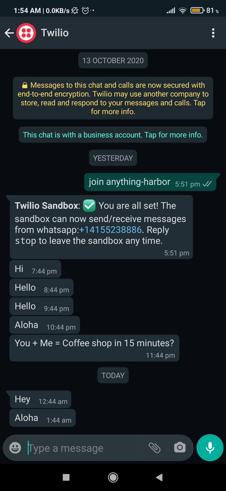
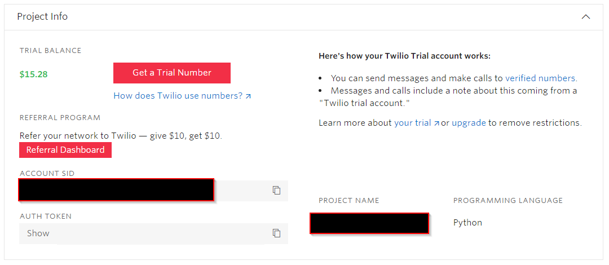
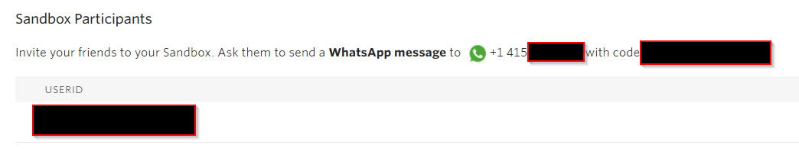

  
  <h1>Automate Whatsapp Messages</h1>
  
   
   
   
  <b align="center">A Python automation script to help you schedule Whatsapp Messages using Twilio </b>

## Output

Configured to send a random message every hour

## Requirements

- Python 3.x

- WhatsApp

- Twilio Account (Trial Account is free)

- PythonAnywhere Account (For deployment)

## Libraries Used:

> twilio

> schedule

Install all the requirements with pip as follows:

  - For Windows:
  ` pip install -r requirements.txt `

  - For Linux:
  ` pip3 install -r requirements.txt `

## Prerequisites 

  
Twilio Account Setup 

  
  ### Steps
  1. Create a <a href="https://www.twilio.com/try-twilio">Twilio Account </a>

  2. Log in to your <a href="https://www.twilio.com/console">Twilio Dashboard </a>. 
     Under the "Project Info" section, take the note for Account SID and Auth Token (Note: These credential need to be added in config.py).
     
     
     
  3. Go to <a href="https://www.twilio.com/console/sms/whatsapp/sandbox"> Twilio WhatsApp Sandbox </a>. 
     Send a WhatsApp message from your phone to the Twilio Number with the given code. This will enable communication between Twilio and Whatsapp. (Note: This needs to be done on both the number sending the automated messages and the ones receiving the message)
     
     
     

  
Python Anywhere Setup (Optional) 

  
  ### Steps
  1. Create a <a href="https://www.pythonanywhere.com/pricing/">PythonAnywhere Account </a> (Works with free account)
  
  2. Log in to your <a href="https://www.pythonanywhere.com/">PythonAnywhere Dashboard </a>. 
    
 

 
 ## Usage
 
 1. Edit the `config.py` file and add the following:
    - Twilio Account SSID [ TWILIO_ACCOUNT_SID ]
    - Twilio Auth Token [ TWILIO_AUTH_TOKEN ]
    - Your Twilio WhatsApp Number [ TWILIO_NUMBER ]
    - Receiver's WhatsApp Number [DESTINATION_NUMBER ]
 
 2. Edit `texts.txt` to add/remove your custom texts.
 
 3. Edit the time/schedule of when to send the automated message. 
    (Refer to https://schedule.readthedocs.io)
 
 4. Run the Python Program Locally
 
    - For Windows:
    ` python local.py `
 
    - For Linux:
    ` python3 local.py `

5. Deploy to PythonAnywhere (Optional)

    
    - Log in to your <a href="https://www.pythonanywhere.com/">PythonAnywhere Dashboard </a>. 

    - In the Files section upload the following files:
        - config.py
        - pythonanywhere.py
        - requirements.txt
        - texts.txt
        
    
     

    - In the Console section, start a new Bash console
    
    
    
    - Run the following commands in the Bash console:
        - ` pip3 install -r requirements.txt --user `
        - ` python3 pythonanywhere.py `
     
        
  
## Support

Reach out to me at:

- Gmail  <a href="http://premnagdeo@gmail.com" target="_blank">`premnagdeo@gmail.com`</a>
- LinkedIn  <a href="https://www.linkedin.com/in/premnagdeo/" target="_blank">`https://www.linkedin.com/in/premnagdeo`</a>
